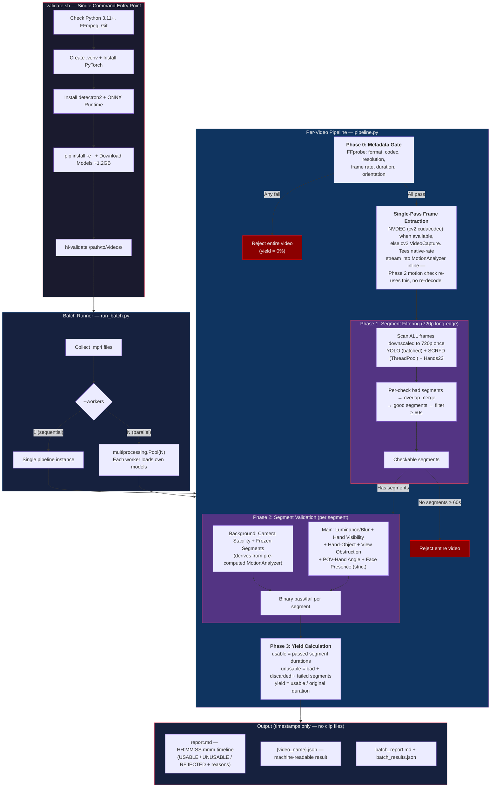

# Egocentric Video Validation & Processing Pipeline

Validates egocentric (first-person POV) videos and produces a timestamped report describing which parts of each video are usable, unusable, or rejected (and why). No clips are extracted — the pipeline classifies time ranges only. Runs a 4-phase pipeline: metadata gate, segment-based filtering, segment validation, and yield calculation.

## Architecture



## Quick Start

```bash
git clone <repo-url> && cd hl-bachman
./validate.sh /path/to/videos/
```

First run takes ~5-10 minutes (installs dependencies, downloads ~1.2GB of model weights). Subsequent runs start in seconds.

Setup only (no pipeline run):

```bash
./validate.sh --setup-only
```

## Requirements

- **Python 3.11+** (3.12, 3.13 also supported)
- **FFmpeg** (ffprobe for metadata)
- **~2GB disk** (model weights + virtual environment)
- **macOS** (Apple Silicon) or **Linux** (Ubuntu/Debian)
- **Windows:** Not natively supported (detectron2 lacks Windows support). Use [WSL2](https://learn.microsoft.com/en-us/windows/wsl/install).
- GPU optional — auto-detected. Force CPU with `FORCE_CPU=1 ./validate.sh ...`

## How It Works

See [checks.md](checks.md) for detailed acceptance conditions and thresholds.

### Phase 0: Metadata Gate (failure rejects entire video)

| Check | Acceptance Condition |
|---|---|
| Format | MP4 container |
| Encoding | H.264 codec |
| Resolution | Displayed dims >= 1920 x 1080 (rotation applied) |
| Frame Rate | >= 28 FPS |
| Duration | >= 119 seconds |
| Orientation | Rotation in {0, 90, 270}, displayed width > displayed height |

### Phase 1: Segment Filtering

Scans ALL frames (no early stopping) for face and participant violations.
Identifies bad segments per check, merges overlapping bad regions, and
extracts good segments >= minimum duration (default 60s) as checkable
segments. Good gaps shorter than the minimum are labeled UNUSABLE
(`segment_too_short`) in the timeline.

| Check | Model | Per-Frame Condition |
|---|---|---|
| Face Presence | SCRFD-2.5GF | No face detected with confidence >= 0.8 |
| Participants | YOLO11s + SCRFD | Zero other persons (wearer's body filtered) |

### Phase 2: Segment Validation

Each checkable segment is validated against remaining checks. Binary pass/fail — segments that fail are labeled REJECTED in the timeline with the failing checks and observed metrics.

| Check | Model | Acceptance Condition |
|---|---|---|
| Luminance & Blur | Tenengrad | >= 70% good frames + stable brightness |
| Camera Stability | LK optical flow at 0.5x (GPU when available) | Shakiness score <= 0.50 |
| Frozen Segments | LK signal | No > 30 consecutive frozen frames |
| Hand Visibility | Hands23 | Both hands in frame in >= 80% frames **OR** at least one hand in frame in >= 90% frames (bbox > 0px from edge) |
| Hand-Object Interaction | Hands23 | Contact with portable/stationary object in >= 60% frames |
| View Obstruction | OpenCV | <= 10% frames obstructed |
| POV-Hand Angle | Geometric | Hands within 40° of center in >= 60% frames |
| Face Presence (strict) | SCRFD-2.5GF (cached from Phase 1) | Zero sampled frames with face confidence >= 0.8 across the entire segment |

### Phase 3: Yield

- **Usable footage** = sum of passed segment durations
- **Unusable footage** = Phase 1 bad segments + discarded short segments + Phase 2 rejected segments
- **Yield** = usable / original duration

## Usage

```bash
# Single video
./validate.sh /path/to/video.mp4

# Directory of videos
./validate.sh /path/to/videos/

# Multiple files
./validate.sh video1.mp4 video2.mp4

# Custom output directory and sampling rate
./validate.sh /path/to/videos/ --output results/ --fps 2

# Custom minimum segment duration (seconds)
./validate.sh /path/to/videos/ --min-segment 90

# Process videos in parallel (auto-detect worker count)
./validate.sh /path/to/videos/ --workers 0
```

### Options

| Flag | Default | Description |
|---|---|---|
| `--output`, `-o` | `bachman_cortex/results` | Output directory for reports |
| `--fps` | `1.0` | Frame sampling rate (FPS) |
| `--min-segment` | `60` | Minimum checkable segment duration (seconds). Clean gaps below this are labeled `UNUSABLE (segment_too_short)`. |
| `--min-bad-segment` | `2` | Bad segments with duration > this many seconds are kept; shorter or equal ones are forgiven |
| `--workers` | `0` (auto) | Parallel video workers (0=auto-detect, 1=sequential) |
| `--yolo-model` | `yolo11s.pt` | YOLO model for object detection |

### After Initial Setup

Once `validate.sh` has run at least once, you can also use the CLI directly:

```bash
source .venv/bin/activate
hl-validate /path/to/videos/
```

## Output

Each run creates a numbered directory (`run_001/`, `run_002/`, ...) containing:

```
results/run_NNN/
├── {video_name}/
│   ├── report.md
│   └── {video_name}.json
├── batch_report.md
└── batch_results.json
```

No video clips are produced — the pipeline reports timestamps only.

- **Per-video `report.md`** — Unified chronological timeline in `HH:MM:SS.mmm` format. Each row is a contiguous range labeled **USABLE**, **UNUSABLE**, or **REJECTED**, with failing checks and observed metrics as reasons. Includes the Phase 0 metadata check table. Metadata-fail videos show a single REJECTED row spanning the whole video.
- **Per-video `{video_name}.json`** — Machine-readable serialization of the full `VideoProcessingResult` (segments, per-check results, metadata, timings).
- **`batch_report.md`** — Topline stats: total yield, total usable / unusable durations, per-video summary table.
- **`batch_results.json`** — Machine-readable batch results.

An `index.md` in the output directory tracks all runs.

## Models

| Model | Purpose | Size |
|---|---|---|
| SCRFD-2.5GF | Face detection | ~14 MB |
| YOLO11s | Person + object detection | ~20 MB |
| Hands23 | Hand detection + contact state | ~400 MB |

Total: ~440 MB downloaded on first run.

## Performance

### Per-Video Benchmarks

Phase 1 scans all frames (no early stopping). Phase 2 runs remaining checks per segment.
Total time depends on how many checkable segments Phase 1 produces.

**Default config:**

| Sample | GPU (CUDA LK + NVDEC) | GPU (CUDA LK + CPU decode) | CPU |
|---|---|---|---|
| 75 s / 1080p / 30fps | ~25 s | ~27 s | ~5 min |
| 501 s / 2336×1080 / 30fps | **~116 s** | ~129 s | ~8 min |
| Metadata-rejected video | <1s | <1s | <1s |

GPU numbers are from an RTX 3060 12 GB with the custom CUDA OpenCV build
(see [`scripts/install_opencv_cuda.sh`](scripts/install_opencv_cuda.sh)).
Without the CUDA build, the pipeline still runs — `cv2.VideoCapture` and
CPU LK are the fallback paths.

### Optimizations

- **Single-pass video decode.** Frame extraction and Phase 2 motion
  analysis share one pass over the video. `frame_extractor.extract_frames`
  tees the native-rate stream into a stateful `MotionAnalyzer` (Lucas-Kanade
  optical flow accumulator). Phase 2 stability / frozen-segment checks
  derive results from the pre-computed analyzer — no per-segment re-open,
  no redundant decode.
- **NVDEC hardware decode.** `extract_frames` uses
  `cv2.cudacodec.VideoReader` when the cv2 build has `cudacodec` and a
  CUDA device is present; otherwise falls back to `cv2.VideoCapture`.
  Frames stay BGR numpy in both paths.
- **Phase 1 downscale to 720p long-edge.** Once per frame at the top of
  Phase 1, feeding YOLO / SCRFD / Hands23 with ~2.3× fewer pixels than
  native 1080p. Controlled by `PipelineConfig.phase1_long_edge`
  (default 720, set None to disable).
- **Raw-frame cache capped at 720p.** Phase 2 consumers
  (luminance/blur, view obstruction) operate on the downscaled cache
  rather than native frames — ~2× lower peak memory.
- **Threaded SCRFD.** Phase 1 dispatches SCRFD face inference across
  the batch via `ThreadPoolExecutor` (default 4 workers), overlapping
  with YOLO and Hands23 calls.
- **Model pre-warm + cuDNN HEURISTIC.** `load_models()` runs one
  synthetic-frame forward pass per loaded model; SCRFD uses
  `cudnn_conv_algo_search=HEURISTIC` to skip the multi-second EXHAUSTIVE
  autotune on first inference.
- **Batched YOLO inference:** 16 frames per batch in Phase 1.
- **Parallel motion derivation:** In Phase 2 the motion-check results are
  sliced from the pre-computed `MotionAnalyzer` rather than re-computed.
- **Hands23 downscaling:** Input capped at 720p (configurable via
  `hands23_max_resolution`). Redundant once Phase 1 already downscales
  to 720p, but kept as a safety net.
- **Single-pass camera stability:** LK optical flow at 0.5× resolution,
  per-frame at 30 FPS target. CUDA GPU acceleration
  (`cv2.cuda.SparsePyrLKOpticalFlow`) when the OpenCV build has CUDA.
- **Frozen detection from LK signal:** Near-zero translation + rotation = frozen. Zero marginal cost on top of stability analysis.

### Batch Processing

Worker count auto-detects based on GPU VRAM (3 GB per worker) or CPU cores. Override with `--workers N`.

## Advanced

### Manual Setup (without validate.sh)

```bash
# 1. Create venv
python3.12 -m venv .venv && source .venv/bin/activate

# 2. Install PyTorch (CPU)
pip install torch torchvision --index-url https://download.pytorch.org/whl/cpu
# Or for CUDA:
# pip install torch torchvision --index-url https://download.pytorch.org/whl/cu121

# 3. Install ONNX Runtime
pip install onnxruntime
# Or for GPU: pip install onnxruntime-gpu

# 4. Install detectron2
pip install 'git+https://github.com/facebookresearch/detectron2.git' --no-build-isolation

# 5. Install this package
pip install -e .

# 6. Download model weights
python bachman_cortex/models/download_models.py

# 7. Run
hl-validate /path/to/videos/
```

### GPU Acceleration

`validate.sh` auto-detects NVIDIA GPUs via `nvidia-smi` and installs the CUDA
build of PyTorch / ONNX Runtime. To force CPU-only:

```bash
FORCE_CPU=1 ./validate.sh /path/to/videos/
```

#### Custom CUDA OpenCV (optional, unlocks NVDEC + CUDA LK)

PyPI's `opencv-python` does not ship with CUDA. To enable
`cv2.cuda.SparsePyrLKOpticalFlow` (GPU optical flow) and
`cv2.cudacodec.VideoReader` (NVDEC hardware decode), build OpenCV from source:

```bash
# 1. Download the NVIDIA Video Codec SDK 12.x headers (requires a free
#    developer-portal login) and extract somewhere readable:
#    https://developer.nvidia.com/video-codec-sdk-archive

# 2. Run the build script (~60 min on a 3060-class GPU):
NVCODEC_SDK="$PWD/Video_Codec_SDK_12.2.72" ./scripts/install_opencv_cuda.sh
```

The script apt-installs CUDA toolkit + build deps (needs sudo once),
clones OpenCV 4.10 + opencv_contrib, configures with `WITH_CUDA=ON` +
`WITH_NVCUVID=ON`, builds with ninja, and installs the custom cv2 into
the venv. It pins the CUDA host compiler to gcc-12 (CUDA 12.0 + Ubuntu
24.04 compatibility) and disables `cv2.dnn` and `cv2.mcc` (OpenCV 4.10
pyopencv bindings for those modules fail to compile on CMake 4.x).

The pipeline provides `bachman_cortex/_cv2_dnn_shim.py` so insightface's
`cv2.dnn.blobFromImage` preprocessing works on the dnn-less build —
installed automatically via `bachman_cortex/__init__.py` before any
insightface import. The shim reproduces `blobFromImage` / `blobFromImages`
in numpy (resize → mean-subtract → scale → NCHW).

After the script finishes, run the pipeline normally — `frame_extractor`
and `motion_analysis` pick up the NVDEC / CUDA paths automatically.

### Pipeline Behavior

- **Phase 0 — Metadata gate:** If any metadata check fails, the video is rejected immediately.
- **Phase 1 — No early stopping:** All frames are scanned to identify bad segment boundaries for the face and participant checks. Bad segments across the two checks are merged (overlapping regions unified). Good segments below the minimum duration threshold are labeled UNUSABLE (`segment_too_short`).
- **Phase 2 — Binary pass/fail:** Each checkable segment is validated against all Phase 2 checks. Motion analysis runs in a background thread while ML inference runs on the main thread. A segment must pass ALL checks to be usable.
- **Phase 3 — Yield:** Usable footage + unusable footage = original video duration.
- **Output:** Timestamps only. The pipeline never cuts the source video; the markdown timeline and JSON report describe which time ranges are usable / unusable / rejected and why.

## Project Structure

```
hl-bachman/
├── validate.sh                  # One-command entry point
├── pyproject.toml               # Package configuration
├── checks.md                    # Check specifications and thresholds
├── README.md
├── scripts/
│   └── install_opencv_cuda.sh   # Builds custom OpenCV with CUDA + NVDEC
└── bachman_cortex/
    ├── __init__.py              # Installs cv2.dnn shim before any import
    ├── _cv2_dnn_shim.py         # Pure-numpy blobFromImage / blobFromImages
    ├── pipeline.py              # ValidationProcessingPipeline (4-phase orchestrator)
    ├── run_batch.py             # CLI entry point (hl-validate)
    ├── data_types.py            # Shared data structures (TimeSegment, CheckableSegment, SegmentValidationResult, etc.)
    ├── reporting.py             # Per-video timeline + batch markdown report generation
    ├── checks/
    │   ├── check_results.py     # CheckResult dataclass
    │   ├── video_metadata.py    # 6 metadata checks
    │   ├── luminance_blur.py    # Tenengrad + luminance + brightness stability
    │   ├── motion_analysis.py   # MotionAnalyzer (single-pass LK) + segment-slicer
    │   ├── participants.py      # Wearer-vs-other heuristics
    │   ├── hand_visibility.py   # Hand detection check
    │   ├── hand_object_interaction.py  # Contact state check
    │   ├── view_obstruction.py  # Lens obstruction heuristic
    │   ├── pov_hand_angle.py    # Hand angle check
    │   └── face_presence.py     # Strict segment-level face presence check
    ├── models/
    │   ├── download_models.py   # Model weight downloader
    │   ├── scrfd_detector.py    # SCRFD face detector (cuDNN HEURISTIC autotune)
    │   ├── yolo_detector.py     # YOLO11s object detector (batch-capable)
    │   └── hand_detector.py     # Hands23 hand-object detector
    └── utils/
        ├── frame_extractor.py   # NVDEC-or-VideoCapture decode + motion-analyzer tee
        ├── video_metadata.py    # FFprobe metadata extraction
        ├── segment_ops.py       # Segment detection, merging, filtering
        └── early_stop.py        # Early stopping monitor (Phase 2)
```
